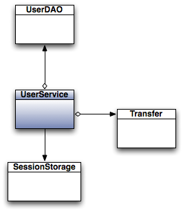

# Creating a Mock Object

In order to create a mock object you need to use any of the following methods: `createMock()`, `createEmptyMock()`, or `prepareMock()`.

## createMock\(\)

Used to create a new mock object from scratch or from an already instantiated object.

```javascript
public any createMock([string CLASSNAME], [any OBJECT], [boolean CLEARMETHODS='false'], [boolean CALLLOGGING='true'])
```

Parameters:

* className - The class name of the object to create and mock
* object - The instantiated object to add mocking capabilities to, similar to using prepareMock\(\)
* clearMethods - If true, all methods in the target mock object will be removed. You can then mock only the methods that you want to mock
* callLogging - Add method call logging for all mocked methods only

```javascript
collaborator = mockbox.createMock("model.myClass");
```

## createEmptyMock\(\)

Used to create a new mock object with all its method signatures wiped out, basically an interface with no real implementation. It will be up to you to mock all behavior.

```javascript
public any createEmptyMock(string CLASSNAME, [any OBJECT], [boolean CALLLOGGING='true'])
```

Parameters:

* className - The class name of the object to create and mock
* object - The instantiated object to add mocking capabilities to, similar to using prepareMock\(\)
* callLogging - Add method call logging for all mocked methods only

```javascript
user = mockbox.createEmptyMock("model.User");
```

## prepareMock\(\)

Decorate an already instantiated object with mocking capabilities. It does not wipe out the object's methods or signature, it only decorates it \(mixes-in methods\) with methods for mocking operations. This is great for doing targeted mocking for specific methods, private methods, properties and more.

```javascript
public any prepareMock([any OBJECT], [boolean CALLLOGGING='true'])
```

Parameters:

* object - The already instantiated object to prepare for mocking
* callLogging - Add method call logging for all mocked methods only

```text
myService = createObject("component","model.services.MyCoolService").init();
// prepare it for mocking
mockBox.prepareMock( myService );
```

> **Caution** If call logging is turned on, then the mock object will keep track of all method calls to mocked methods ONLY. It will store them in a sequential array with all the arguments the method was called with \(named or ordered\). This is essential if you need to investigate if a method was called and with what arguments. You can also use this to inspect save or update calls based on mocked external repositories.

  
 **Sample:**



Let's say that we have a user service layer object that relies on the following objects:

* **sessionstorage** - a session facade object
* **transfer** - the transfer ORM
* **userDAO** - a data access object for complex query operations

We can start testing our user service and mocking its dependencies by preparing it in a test case CFC with the following `setup()` method:

```javascript
component extends=”testbox.system.BaseSpec” {

    function beforeAll(){
        //Create the User Service to test, do not remove methods, just prepare for mocking.
        userService = createMock("model.UserService");

        // Mock the session facade, I am using the coldbox one, it can be any facade though
        mockSession= createEmptyMock(className='coldbox.system.plugins.SessionStorage');

        // Mock Transfer
        mockTransfer = createEmptyMock(className='transfer.com.Transfer');

        // Mock DAO
        mockDAO = createEmptyMock(className='model.UserDAO');

        //Init the User Service    with mock dependencies
        userService.init(mockTransfer,mockSession,mockDAO);
    }

    function run(){

        describe( "User Service", function(){
            it( "can get data", function(){
                // mock a query using mockbox's querysimulator
                mockQuery = querySim("id, name
                1|Luis Majano
                2|Alexia Majano");
                // mock the DAO call with this mocked query as its return
                mockDAO.$("getData", mockQuery);

                data = userService.getData();
                expect( data ).toBe( mockQuery );
            });
        });

    }

}
```

The service CFC we just injected mocked dependencies:

```javascript
<cfcomponent name="UserService" output="False">

<cffunction name="init" returntype="UserService" output="False">
  <cfargument name="transfer">
  <cfargument name="sessionStorage">
  <cfargument name="userDAO">
  <cfscript>
    instance.transfer = arguments.transfer;
    instance.sessionStorage = arguments.sessionStorage;
    instance.userDAO = arguments.userDAO;

    return this;
  </cfscript>
</cffunction>

<cffunction name="getData" returntype="query" output="false">
    <cfreturn instance.userDao.getData()>
</cffunction>

</cfcomponent>
```

